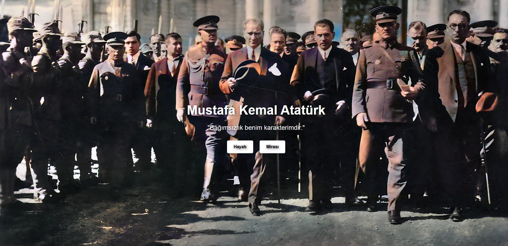
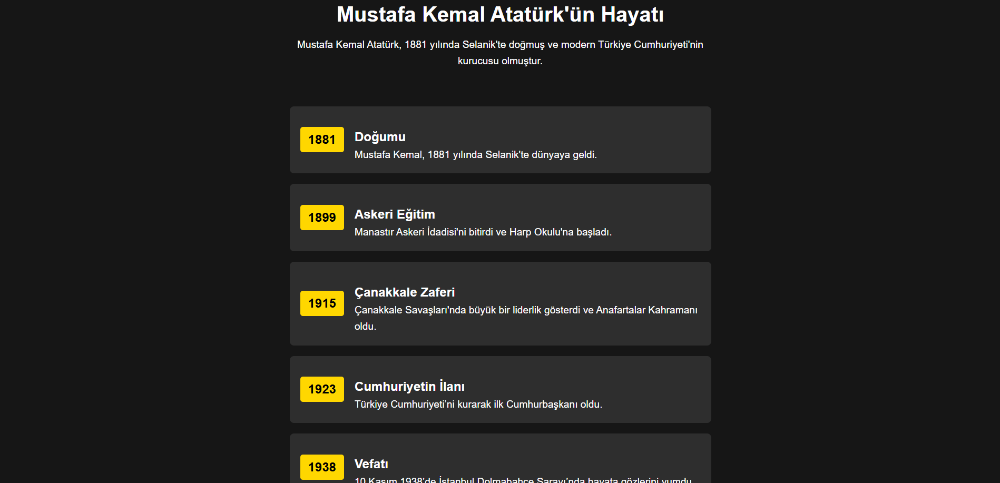
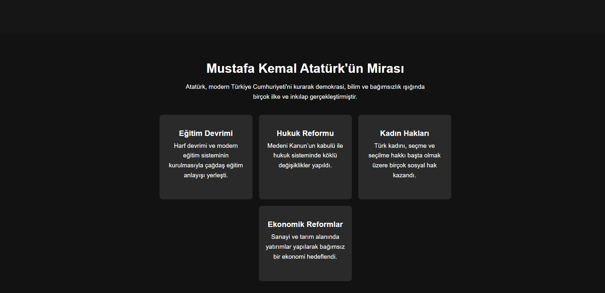

# 🇹🇷 Mustafa Kemal Atatürk Tribute Website

Bu proje, **Mustafa Kemal Atatürk'ü** anmak ve mirasını tanıtmak amacıyla hazırlanmış bir web sitesidir.  
Site, Atatürk'ün **hayatını, reformlarını ve mirasını** modern ve şık bir tasarımla sunmaktadır.

---

## 🚀 **Proje Özellikleri**
✅ **Hero Bölümü**: Büyük bir Atatürk görseli ve etkileyici bir giriş metni  
✅ **Hayatı**: Atatürk'ün yaşamının önemli anlarını içeren zaman çizelgesi  
✅ **Mirası**: Eğitim, hukuk, kadın hakları ve ekonomi reformlarını vurgulayan kart tasarımı  
✅ **Tamamen Responsive**: Mobil ve masaüstü uyumlu şık bir tasarım  
✅ **CSS Animasyonları**: Hover efektleriyle modern bir kullanıcı deneyimi  

---

## 📷 **Ekran Görüntüleri**

### 🎨 Ana Sayfa (Hero Bölümü)


### 📜 Atatürk'ün Hayatı (Zaman Çizelgesi)


### 🏛 Atatürk'ün Mirası (Kart Tasarımı)



---

## 📥 **Kurulum ve Kullanım**
1. **Projeyi klonla:**
   ```bash
   git clone https://github.com/kullaniciadi/mustafa-kemal-tribute.git

